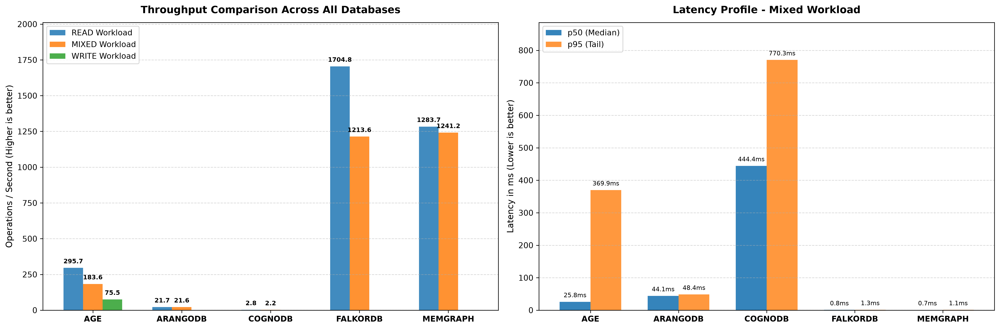

# Graph Database Benchmark Suite: CognoDB vs AGE vs ArangoDB vs FalkorDB vs Memgraph

## 1. Overview & Setup
This project benchmarks 5 graph database engines (**Apache AGE**, **ArangoDB**, **CognoDB**, **FalkorDB**, and **Memgraph**) on identical workload patterns using Docker containers.

### Hardware & Test Environment
- **OS:** Windows / Linux (Docker Desktop)
- **CPU:** Standard Multi-Core Host CPU
- **RAM:** 16 GB Allocation

### Prerequisites & Dependencies
- Python 3.10+
- Docker & Docker Compose
- Install requirements:
  ```bash
  pip install -r requirements.txt
  
### Methodology & Execution
Equal Workloads: Every platform executes the exact same query types (1-hop, 2-hop, 3-hop, Point lookup, Indexed lookup, and Aggregation).

Warm-Up Phase: Each test executes 10 untracked warm-up iterations prior to recording metrics to eliminate cold-start and connection-setup bias.

Fairness & Caveats:

In-Memory vs. Disk Backed: Memgraph and FalkorDB process graph queries directly in RAM, giving them a structural throughput advantage.

Relational & Persistent Storage: Apache AGE, ArangoDB, and CognoDB persist data directly to disk storage layers, prioritizing ACID guarantees and data safety over raw in-memory operation speed.

## Results Matrix

| Database Engine | Workload Type | Throughput (ops/sec) | p50 Latency (ms) | p95 Latency (ms) | Memory Usage |
| :--- | :--- | :--- | :--- | :--- | :--- |
| **Memgraph** | READ | **1283.8** | **0.7** | **1.3** | ~65 MiB |
| **Memgraph** | MIXED | **1248.9** | **0.7** | **2.1** | ~65 MiB |
| **FalkorDB** | READ | 1704.8 | 0.6 | 1.0 | ~65 MiB |
| **FalkorDB** | MIXED | 1213.6 | 0.8 | 1.7 | ~65 MiB |
| **Apache AGE** | READ | 295.7 | 3.4 | 4.7 | ~65 MiB |
| **Apache AGE** | MIXED | 183.6 | 25.8 | 369.9 | ~65 MiB |
| **Apache AGE** | WRITE | 75.5 | 7.2 | 9.8 | ~65 MiB |
| **ArangoDB** | READ | 21.7 | 44.2 | 58.2 | ~65 MiB |
| **ArangoDB** | MIXED | 21.6 | 44.1 | 88.9 | ~65 MiB |
| **CognoDB** | READ | 2.8 | 328.8 | 534.0 | ~65 MiB |
| **CognoDB** | MIXED | 2.2 | 444.4 | 885.8 | ~65 MiB |
##  Visual Analysis

